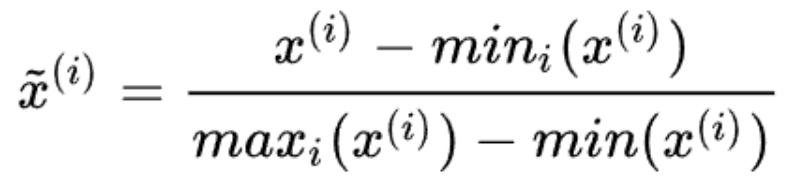
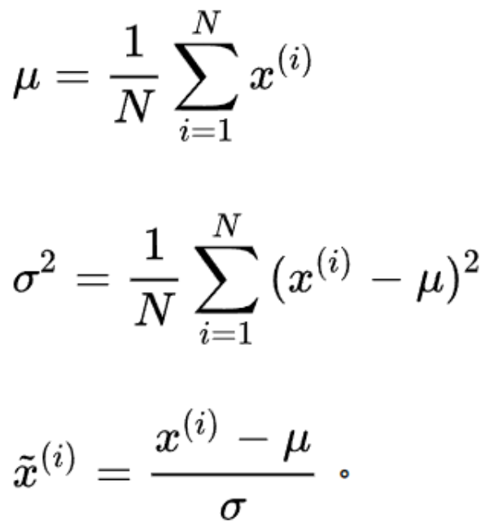

# 就是数据处理了咯

## 数据获取
爬它妈的

## 数据清洗
使数据正常，不离谱。主要是清洗掉人为标注的错误。有时需要对数据添加噪声，使模型具有泛化性

## 数据标准化（或者叫数据归一化）
将数据归一化到特定范围之间，比如0-1之间，目的是规避单位的影响。
1. min-max normalization
   
   ```python
   def Normalization(x):
        return [(float(i)-min(x))/float(max(x)-min(x)) for i in x]
    ```

2. z-score normalization
   
   ```python
   import numpy as np

    def z_score(x):
        x -= np.mean(x)
        x /= np.std(x)
        return x
    ```

## 数据增强
翻转、旋转、缩放比例、裁剪、移位、同义替换、杂交、叠加等方式来实现扩增
加噪声提高泛化性
