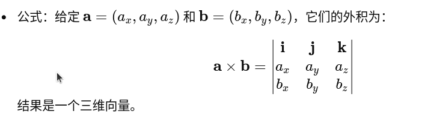
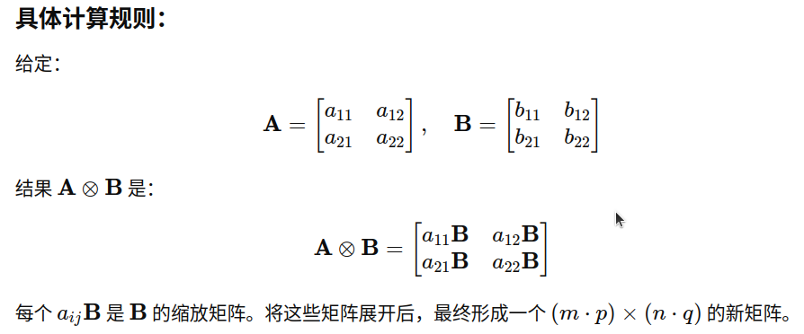

# 必修：numpy
### numpy是高级数组玩具，跟pytorch很像  
## numpy的核心是ndarray，其实就是数组  
```python
import numpy as np
a = np.array([
    [1,2,3]
    [4,5,6]
    [7,8,9]
    [10,11,12]
    ])
a.shape #返回a的形状,会得到一个元组，依次为各个轴长度，0轴是4，1轴是3。
a.ndim #返回a的维度，就是轴的个数，就是a.shape的length
a.size #返回a的元素个数，就是a.shape的乘积
a.dtype #返回a的数据类型
## 创建ndarray
a = np.array([[1,2,3],
              [4,5,6]
              ])
b = np.ones((2,3))
c = np.zeros((2,3))
d = np.arange(10,20,2) #返回一个从10到20的步长为2的数组,左闭右开
e = np.arange(10).reshape(2,5)
f = np.linspace(0,1,6) #返回一个从0到1的等差数列，包含0和1，包含6个数
g = np.full((2,3),5) #前形状，后值
h = np.full_like(a,5) #跟a形状一样，全5
i = np.random.rand(2,3) #直接输形状,不用元组；值为0到1间随机数，后面那个rand改成uniform,则为均匀分布，改为randn,则为正态分布
j = np.random.randint(0,10,size=(2,3)) #前为随机范围，后为形状
k = np.identity(3) #返回一个单位矩阵,传入维度
m = np.eye(3) #返回一个单位矩阵,传入维度,或者形状
l = np.repeat(a,2,axis=0) #指定轴，重复a两次
##产生随机数
np.random.randint(0,9) #随机数,左闭右开
## 索引，切片
a[0,0] #跟那个数组一毛一样
a[0,:] #这样切片显得很牛逼
##运算，按元素操作，直接四则运算加**一个幂运算就行
# 矩阵运算
a.T #转置
a.dot(b) #a点乘b;;或者直接 a@b
np.outer(a,b) #a外积b,让我们回忆一下外积，这也不是矩阵外积呀，他的意思是把a、b展平成向量，然后矩阵乘法，成了一个a.size行，b.size列的矩阵
```
## 向量外积

## 矩阵外积

```python
## 统计运算
a.sum() #求和，可指定轴，即可降维
a.max() #最大值,可指定轴,似乎也能降维
a.mean() #平均值,可指定轴,似乎也能降维
a.std() #标准差,可指定轴,似乎也能降维
a.cumsum() #累加和,可指定轴,似乎没什么卵用
## 张量变形
a.reshape(2,2,3) #改变形状，如果无法整除，会报错
a.ravel() #拉平，返回一个向量
    #切片一定要注意，从0开始，左闭右开
a[...,2:3] #...表示全都要（同时多个维度）
np.vstack((a,b)) #竖堆叠，按第0轴拼接，列一样多操作
np.hstack((a,b)) #横堆叠，按第1轴拼接，行一样多操作
np.concatenate((a,c),axis=0) #拼接咯
np.vsplit(a,2) #竖分割，按第0轴分割, 提取所有行
np.hsplit(a,2) #横分割，按第1轴分割, 提取所有列
np.split(a,2,axis=0) #分割咯
```
# 先学这点鸡毛吧