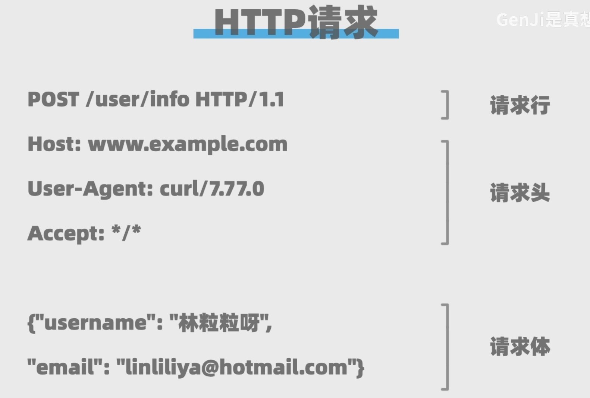
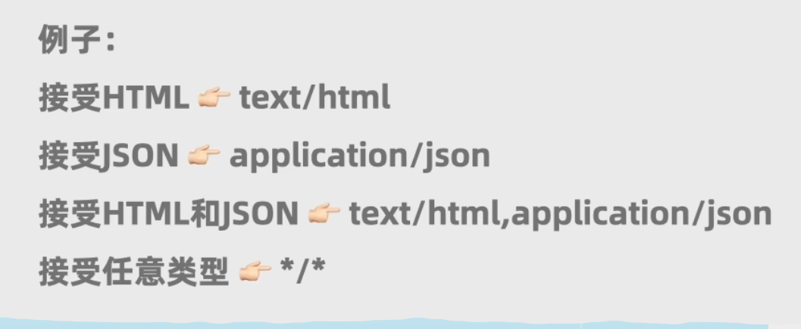
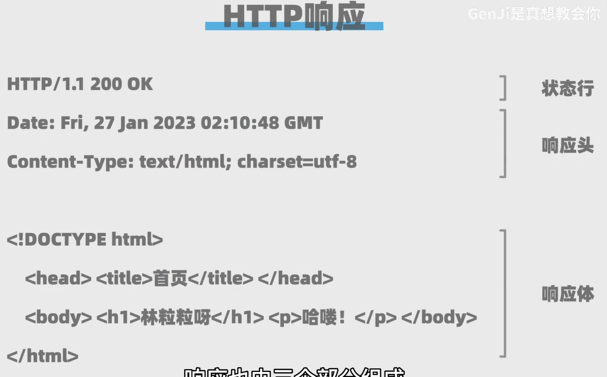
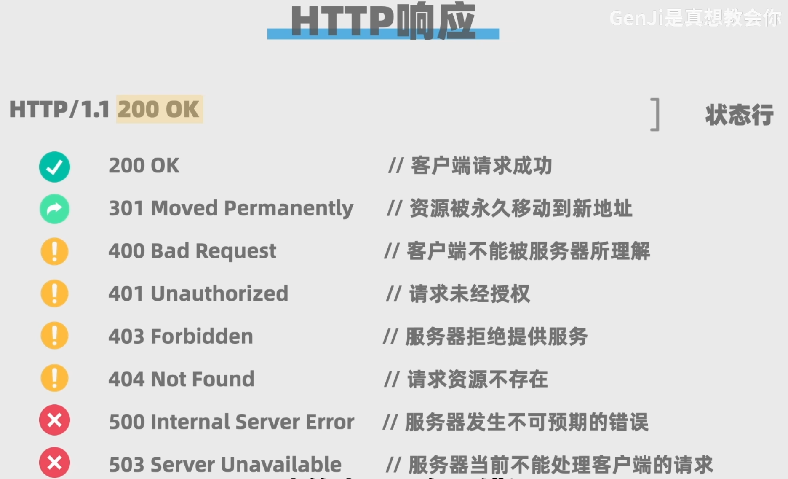
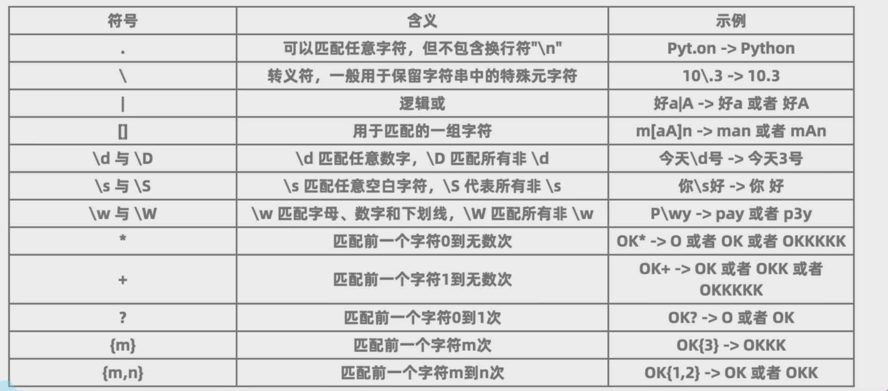

# 就是爬虫咯

### 爬取网页数据，先由客户端发送请求，服务器端返回数据，客户端解析数据。

## HTTP请求



1. **请求行**  
   请求行由三个部分组成：请求方法、请求目标、请求协议版本。  
   - 请求方法：GET、POST等。爬虫一般是get；而post用在表单提交数据。
   - 请求目标：请求的资源路径。（指明要访问服务器哪个资源）与请求头中的Host组成一个完整的网址，在问号“？”之后，是查询参数，参数间用&分隔。
   
   - 请求协议版本：HTTP/1.1  

2. **请求头**  
   请求头包含给服务器的信息
   - Host：主机域名
   - User-Agent：客户端信息 #例如python的requests库，这里就是: Python-Requests/2.25.1
   - Accept: 告诉服务器，客户端想接受的数据类型，多种类型可用逗号分隔
   

3. **请求体**  
   客户端给服务器的一些数据，但是get类型的请求体一般为空

## HTTP响应



1. **状态行**  
   状态行由三个部分组成：协议版本、状态码、状态描述。
   - 协议版本：HTTP/1.1
   - 状态码：200、404等，与状态描述一一对应
   - 状态描述：OK、Not Found等  
   
2. **响应头**  
   响应头包含服务器给客户端的信息,例如Date响应日期，Content-Type响应类型及编码格式等等
3. **响应体**  
   即服务器返回给客户端的数据，例如html、json、图片等。  

## python 爬一下
```python
import requests
headers = {"User-Agent": 'Mozilla/5.0 (Windows NT 10.0; Win64; x64)' } #篡改请求头，将程序请求伪装成浏览器
response = requests.get('http://books.toscrape.com/') #发送get请求
if response.ok:                 #直接判断响应码是否为200（成功）
    print(response.text)        #打印响应体
else :
    print("请求失败")
```

## html

```html
<!DOCTYPE HTML>    #告知浏览器当前文档为html格式，所有尖括号包起的都是html标签
<html>             #html标签,表示开始
   <body>          #body标签,主体
      <h1>一级标题</h1> 
      <h1>二级标题</h1>

      <p>段落</p>
      <p>不同段落之间自动换行，不过<br>标签可以在这里强制换行，它没有闭合标签</p>
      <p>字体呢？，<b>这个是加粗</b>,<i>这个是斜体</i>,<u>这个是下划线</u>好吧</p>
      <p class="content">这个class可以用在任何元素里，用来给同类别元素分组 </p>

      

      <a href="链接"target="_self">点击这里,那个target也可以是_blank，表示新标签页打开</a>

      <div>
         <p>
            这个div就是一个容器，本身不包含内容，但是可以包含其他标签（子元素），目的是方便批量操作，（css渲染，直接给到容器就行了）
         </p>
      </div>
      
      <span>
         <p>
            这也是一个容器，区别是，div是块级元素（自动换行），span是内联元素，可以在同一行显示
         </p>
      </span>

      <ol>
         <li>这个是有序列表咯</li>
         <li>列表中的元素都用li标签</li>
      </ol>

      <ul>
         <li>当然就有无序列表咯</li>
      </ul>

      <table>
         <thead>     #表格头，即表格第一行
            <tr>     #表格行
               <td>表头1</td>
               <td>表头2</td>
            </tr>
         </thead>

         <tbody>     #表格主体
            <tr>
               <td>内容1</td>
               <td>内容2</td>
            </tr>
            <tr>
               <td>内容3</td>
               <td>内容4</td>
            </tr>
         </tbody>
      </table>

   </body>
</html>            #html标签,表示结束
```

## beautiful soup
```python
from bs4 import BeautifulSoup
soup = BeautifulSoup(response.text, 'html.parser')  #解析html
print(soup.p)  #打印第一个p标签  
titles = soup.find_all('h3',attrs={'class':"title"})  #查找所有h3标签,可选参数attrs传入一个字典，对应了要求的属性
## 可以先查找上一级标签，再for循环查找子标签
for title in titles:
   print(title.text)    #要不就是title.string，反正其中一个，不好看再用字符串刷刷刷
```

## 正则表达式
